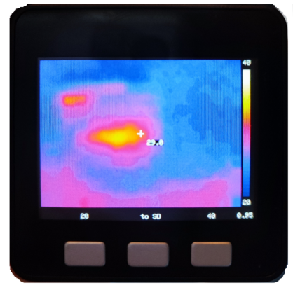

# ThermoCam
A very basic thermal imager, based on M5Stack Core (ESP32) and MXL90640 Module

This is a tiny thermal Imager using the [M5 Core BASIC](https://docs.makerfactory.io/m5stack/core/black/) and the
[MLX90640 Thermal Sensor Unit](https://shop.m5stack.com/products/thermal-camera).

The MLX90640 thermal sensor provides 32x24px thermal data, so the visible image needs to upscaled to a larger image size,
to fit the displays resolution of 320x240.



As the ESP32 inside the M5 Core is very limited in floating point performance, both the recreation of the
thermal data and the upscaling takes a lot of time. Still, a refresh rate of slightly more than 3Hz is possible.

Another issue is the very limited RAM ressource on ESP32. It's not possible to hold a complete image in RAM like a frame buffer.
And the M5 Core Basic doesnt have external RAM. Therefore, upscaling is done in small parts of the image, reusing the memory
for different purposes. But, this again takes away a bit of cpu time.

In the image below, there is a comparison of different upscaling algorithms on the same (real) temperature data.


In this project, bicubic upscale is used, see right picture.


This project is in progress.


## Current Status
The current implementation supports
* 3..4Hz reprate
* bicubic interpolation of thermal data
* IronBow heat map
* setting of min and max temperature
* setting of emissivity
* store temperature data to SD card
* Tmin, Tmax, emissivity are stored in/restored from EEPROM

## Usage
### Turning off the device
Double click the power button near USB-C port.
### Set Tmin
Push left button. Tmin increases in steps and flips over to lowest value at range end.
After about 30secs, the value is stored in EEPROM.
### Set Tmax
Push right button. Tmax increases in steps and flips over to lowest value at range end.
After about 30secs, the value is stored in EEPROM.
### Set emissivity
Push right button and left button together. The emissivity steps trough a range of selected materials.
After about 30secs, the value is stored in EEPROM.

Currently, the following materials are implemented:
* Human Skin (e = 0.98)
* Water, Paint or Cloth (e = 0.95)
* polished Aluminium (e = 0.10)
* anodized Aluminium (e = 0.65)
* Stainless Steel(e = 0.59)
* Plastic (e = 0.93)
* Ceramic (e = 0.94)
* Glass (e = 0.87)
* Rubber (e = 0.90)

### Store current image as file on SD card
Push the middle button.

Storing the image on SD card requires a pristine SD card inserted using the FAT or VFAT file system.
You may need to run the _HP USB Disk Storage Format Tool_ on used SD cards to restore the original file system before.

I'm using a very cheap noname 32GB SDHC card, which works fine.
Some SD cards dont work together with Arduino/ESP32.

The image is stored as temperature data, not as image pixels.
Converting this file into a Portable Network Graphic is done by the 64bit Windows binary in this repo.
If you use this tool, you can later choose the temperature range to be displayed, image size in pixels and
the upscaling algorithm to be used.
The files are stored in the subfolder thermal.
```
  /thermal
     0000.rdf
     0001.rdf
     0002.rdf
```
### The Image Converter Tool


The image converter tool converts the files on SD card to a Portable Network Graphic (PNG) file.
You may change the pixel resolution, temperature min and max and upscaling algorithm.
Change of heat map could be easily done here too, but is not yet implemented.


--Winfried
